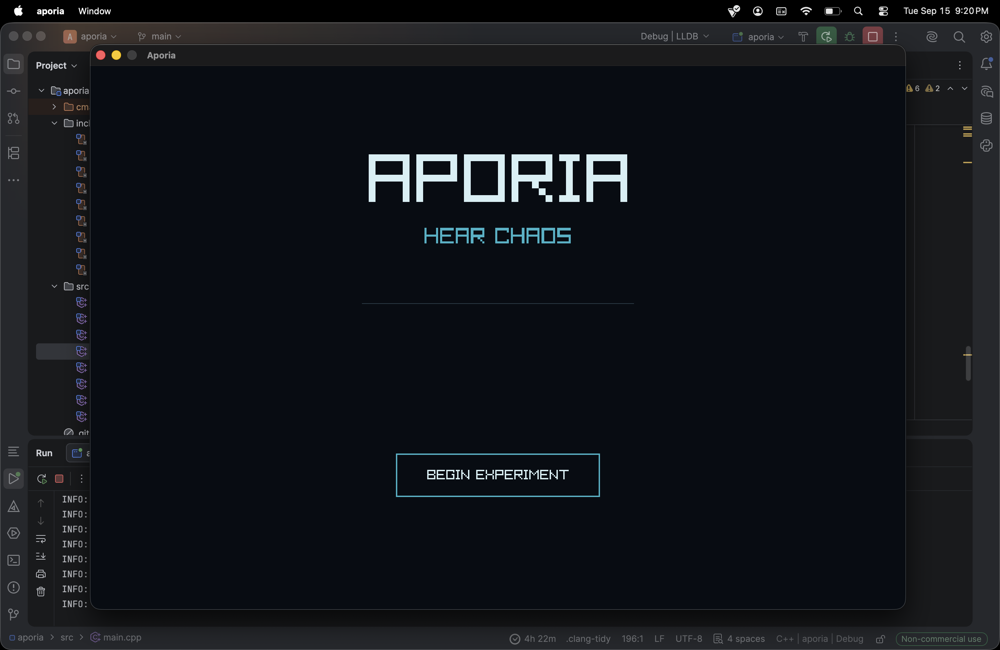
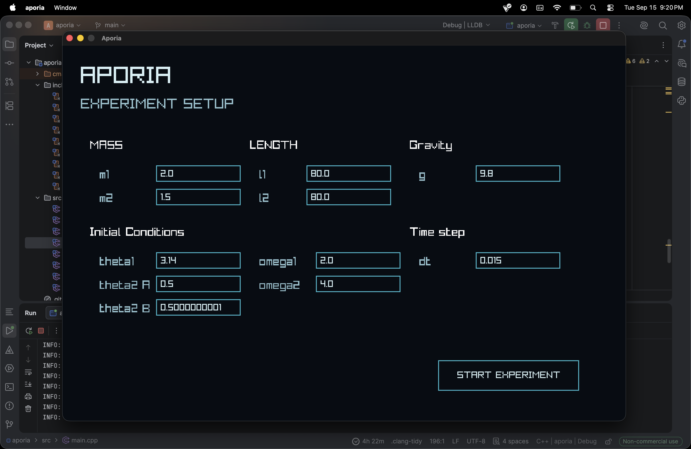
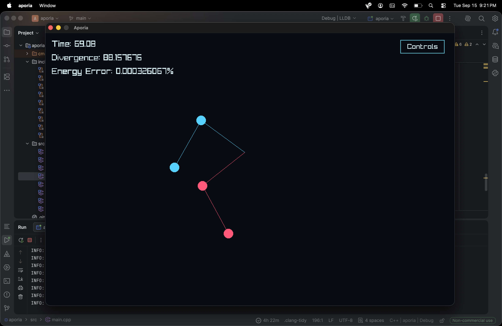

# Aporia: Hear Chaos

> Two almost identical pendulums. One tiny difference. Completely different futures.

Aporia is a double-pendulum simulation that lets you **see and hear chaos**
(that is, if you have eyes and ears... if not, well then, idk 🗿🤷🏻‍♂️)

The project started with a simple question:

**What happens if two systems begin almost exactly the same, but not quite?**

The answer, as usual, is that physics has a rather dramatic sense of humor. (exactly my type btw 🥀)  

---

## What it does

Aporia simulates two double pendulums with the same physical parameters but slightly different initial conditions

For example, both pendulums start with the same angles, masses, lengths, and angular velocities, except for a tiny difference in one angle:

```text
theta2 A = 0.5
theta2 B = 0.5000000001
```
In case you're curious, that difference is roughly an atomic-scale displacement if the pendulum length is around a metre.

At first, their motion looks almost identical. But as time passes, the trajectories diverge.<br>
(with default config, they couldn't even last a minute together 🥀💔)

The simulation also tracks:

- The current simulation time
- The divergence b/w the two pendulums
- Energy error (in %)
- The motion of both pendulums
- The sound generated from their movement

---

## Sonification

The interesting part is that the pendulums aren't only visualized.

They're also turned into sound. (fancy, innit? 🐈)

- The angular position determines the pitch.
- The angular velocity determines the volume.
- Each pendulum has its own audio stream.

So, as the pendulums begin to move differently, their sounds gradually become different too.


The result is essentially a way to **hear sensitive dependence on initial conditions**.

It is not meant to be a scientifically perfect musical instrument. It is a way of translating the behavior of a chaotic system into something that can be experienced through both sight and sound.

---

## Numerical method

The simulation currently uses the **fourth-order Runge-Kutta method (RK4)** for integration.

Tho I also implemented Euler integration earlier for comparison and testing.

The project tracks energy error to get a rough idea of how well the numerical method is behaving. With ~~sane~~ suitable timestep values, RK4 performs considerably better than Euler Integration for this system.

The simulation is not intended to be a complete physics engine. It is mainly an experiment in:

- Classical mechanics
- Numerical integration
- Chaotic systems
- Scientific visualization
- Sonification 
- C++ project structure

---

## Controls

| Key | Action |
|---|---|
| `Space` | Pause / resume the simulation |
| `N` | Advance one timestep while paused |
| `R` | Reset the simulation |
| `M` | Mute / unmute audio |
| `Backspace` | Return to experiment settings |
| `H` | Return to the home screen |
| `Esc` | Close the controls overlay |


You can also click the **Controls** button in the top-right corner of the simulation screen.
(for literally the same thing, but anyways 🪿)

---

## Tech used

- C++ 
- Raylib
- RK4 numerical integration
- Euler integration
- Double pendulum mechanics 
- ~~Stark Industries **nuclear arc reactor**~~
- Basic real-time audio generation 

The project (for my mental sanity 🍀) is split into separate parts for the pendulum physics, integrators, simulation, analysis, rendering, experiment settings, and sonification.

---

## A few things I learned

The project began as a relatively small double-pendulum simulation, and then slowly became a collection of files, functions, parameters, rendering code, audio code, and several opportunities to discover that one small typo can ruin an otherwise respectable afternoon.

Before this project, I was relatively a beginner in C++ <br>
But I learned new things whenever I needed them, instead of trying to learn the entire language beforehand.

A few things I ended up learning through it:

- How to derive and implement the eqn of motion (using Lagrangian and Hamiltonian).
- How numerical integration ~~violates~~ affects energy conservation.
- Why RK4 is much more reliable than basic Euler integration for this kind of simulation.
- How small changes in initial conditions can become very large differences later.
- How to separate a growing C++ project into multiple files.
- How to generate and stream audio in real time.
- How to connect a physics simulation to a visual interface.
- How to ensure the application doesn't immediately perish because someone typed banana into gravity.

---

## Future improvements

There are still plenty of things that could be improved:

- More sonification methods
- Better audio smoothing and musical control
- More numerical integrators
- Better analysis of divergence
- More detailed energy and momentum diagnostics
- etc etc...

I may add them in the future, but for now, the main experiment is working:

**Start two nearly identical systems, watch them separate, and listen to the difference.**

---

## Screenshots

### Home screen



### Experiment setup



### Simulation




---

## Installation (Only for macOS)

- Go to the releases section (below the About)
- Select "Aporia V1.0"
- Download the file (aporia.app.zip) and simply run it :)

### Note:
Since this app is currently unsigned and not notarized, macOS may prevent it from opening after download.

If that happens:
- Move `aporia.app` to Applications
- Right click it
- Choose "Open" and confirm

If macOS still reports that the app is damaged.
- Open Terminal
- Run `xattr -dr com.apple.quarantine "/Applications/aporia.app"`
- And run the app again.

---

### And with that,,,,, Thank you for trying out my project!! 🦋️<br>
~ It has been an honor... 🍀
